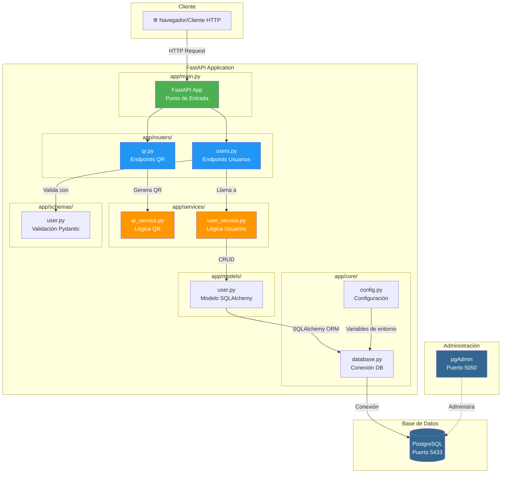
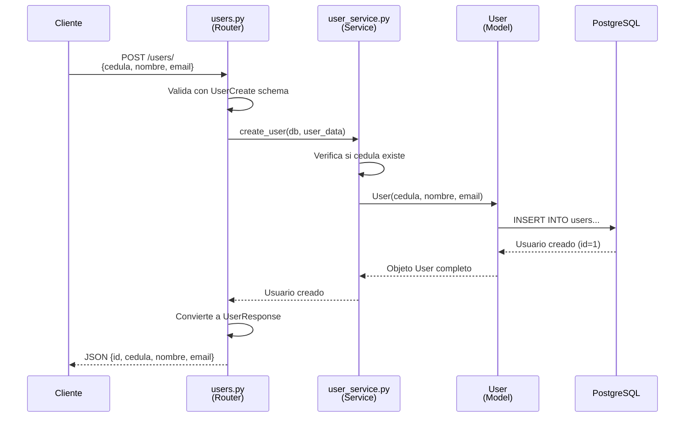

# Diagrama de Arquitectura - QR Generator API

## Flujo de Datos de la Aplicación



## Explicación del Flujo

### 1. **Cliente → Router** (Capa de Presentación)
```
GET /users/123456
     ↓
app/routers/users.py
```
- El cliente hace una petición HTTP
- FastAPI la enruta al router correspondiente
- El router valida los datos con Pydantic schemas

### 2. **Router → Service** (Capa de Negocio)
```
users.py → user_service.get_user_by_cedula()
```
- El router delega la lógica al servicio
- El servicio NO conoce HTTP, solo trabaja con datos Python

### 3. **Service → Model** (Capa de Datos)
```
user_service.py → User (SQLAlchemy Model)
                    ↓
                database.py (Session)
                    ↓
                PostgreSQL
```
- El servicio usa el modelo para interactuar con la BD
- SQLAlchemy traduce objetos Python a SQL

### 4. **Respuesta** (Camino inverso)
```
PostgreSQL → Model → Service → Router → Cliente (JSON)
```

## Ejemplo Concreto: Crear Usuario



## Responsabilidades por Capa

| Capa | Carpeta | Responsabilidad | Conoce HTTP? | Conoce BD? |
|------|---------|-----------------|--------------|------------|
| **Presentación** | `routers/` | Recibir requests, validar, devolver responses | ✅ Sí | ❌ No |
| **Negocio** | `services/` | Lógica de la aplicación, reglas de negocio | ❌ No | ✅ Sí |
| **Datos** | `models/` | Estructura de las tablas, relaciones | ❌ No | ✅ Sí |
| **Configuración** | `core/` | Settings, conexión DB | ❌ No | ✅ Sí |
| **Validación** | `schemas/` | Formato de entrada/salida | ❌ No | ❌ No |

## Ventajas de esta Arquitectura

1. **Separación de Responsabilidades**: Cada capa tiene un trabajo específico
2. **Testeable**: Puedes probar servicios sin levantar el servidor HTTP
3. **Reutilizable**: Los servicios pueden usarse desde CLI, workers, etc.
4. **Mantenible**: Cambios en una capa no afectan a las demás
